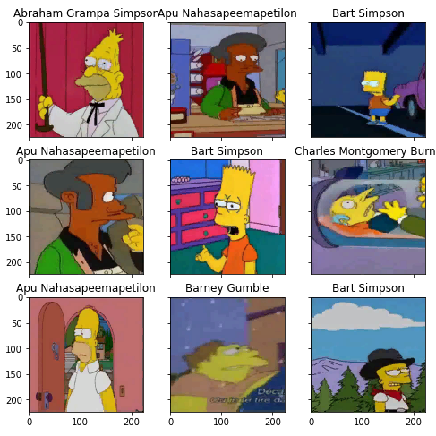
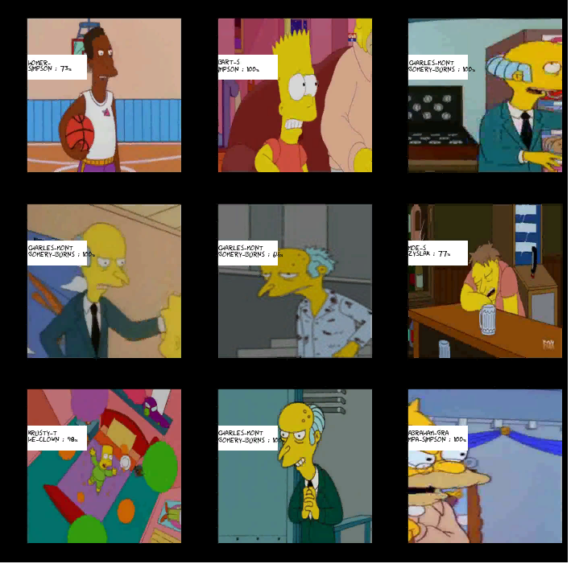

# Classification-Sympsons
The main task will be to train the classifier on the basis of bundling networks to learn to distinguish all Springfielders.

The training and test sample consists of excerpts from the Simpson cartoon series. Each picture is presented in jpg format with the necessary label - the name of the character depicted on it. The test was divided into private and public parts in a ratio of 95/5.

The training dataset contains about 1000 pictures for each class, but they differ in size.

An important point: class labels are presented as the names of the folders in which the pictures are stored.

Description of files:
  train.csv - the training set
  testset.csv - the test set

Data Fields
  * image_id - id pictures
  * Expected - character's name

Dataset https://drive.google.com/file/d/1Ott_w4IxaA94O7Hxm0xIKl1NTyO6cZcx/view?usp=sharing

